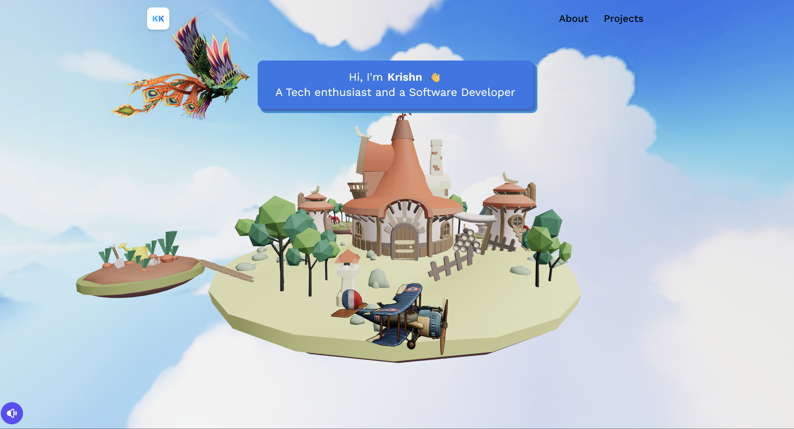
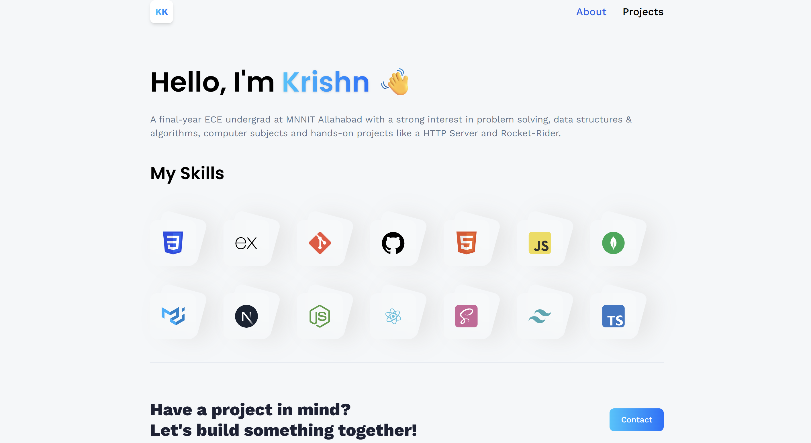
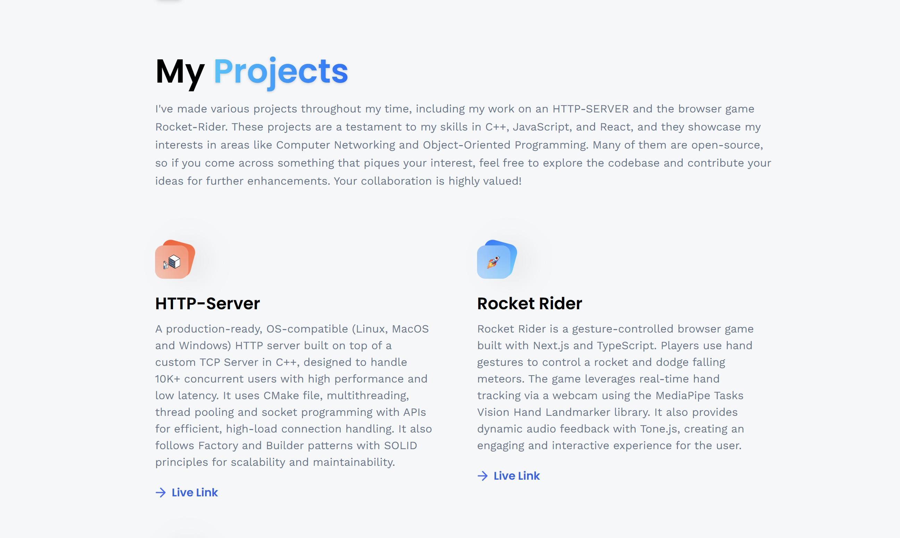
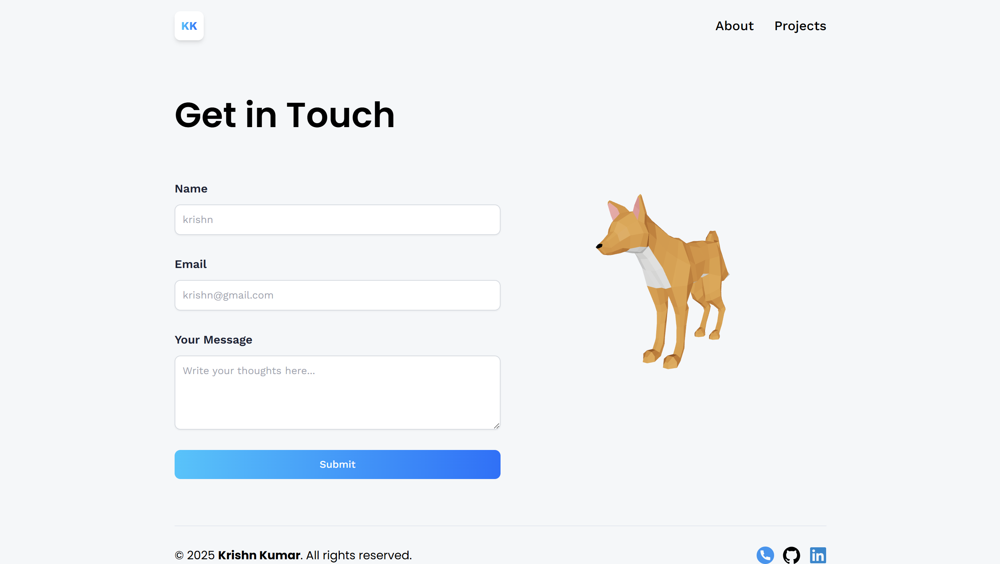

# Krishn Kumar | 3D Portfolio

  

>  I'm **Krishn Kumar**, a final-year B.Tech student in **Electronics and Communication** from **MNNIT Allahabad**, with a strong inclination toward the software domain. I have a solid problem-solving background in **DSA**, strong knowledge of Computer subjects and i've built **projects** like an **HTTP Server**- A production-grade TCP-based server and **Rocket Rider**- A gesture-controlled browser game. I'm passionate about solving challenges and look forward to use my skills and  contribute as a **Software Developer**.

Open [Krishn's Portfolio](https://kk-portfolio-taupe.vercel.app/) in your browser.

---

## Portfolio Overview

  

**About:**
- Explore the diverse range of skills I've developed through hands-on, real-world projects and academic work. Here, you'll find the technologies and methodologies I've mastered to build impactful applications.

  

**Projects:**
- It demonstrates my development side as i have made various projects like a production grade HTTP Server and an interactive web browser.

  

**Contact:**
- **Looking for a software developer or need a project done? 
I’m just a few keystrokes away—let's talk!!**
- I'm always open to new opportunities and partnerships. Don't hesitate to share your ideas for a project you have in mind. You can easily get in touch via my contact form or by connecting with me on LinkedIn. 

-----

## Tech Stack
- **FrontEnd:** [React](https://react.dev/)

- **Language:** JavaScript
- **Styling:** [Tailwind CSS](https://tailwindcss.com/docs/installation/using-vite), [Flat Icon](https://www.flaticon.com/)
- **3D Graphics:** [Three.js](https://threejs.org/manual/#en/creating-a-scene), [SketchFab](https://sketchfab.com/), @react-three/fiber
- **Services:** [EmailJs](https://www.emailjs.com/)
---

## Summary

>  This is a personal **3D portfolio** website for a developer named Krishn Kumar, built using **React** and **Tailwind CSS**. It's a single-page application that uses React Router for navigation and Vite as a build tool. The project's main feature is an interactive 3D environment created with **Three.js** and **@react-three/fiber**. The site showcases my skills and projects, including a **3D island model** that rotates to reveal different sections of the portfolio. An integrated contact form uses **EmailJS** to send messages.